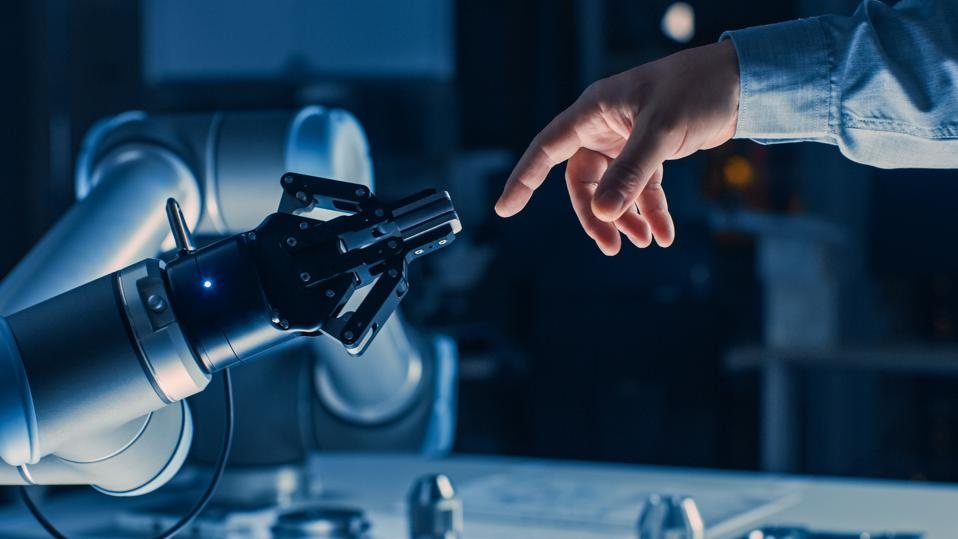

# The Freudian Robot...
## A Very Confusing Concept I am not sure I understand

Robots vs Automatons. The reading talks about the difference betweens robots and automatons. It suggests that robots are more than just mechanics and that the lines between man and robot will soon disappear and that we will all become robots — can’t lie, very confusing.

### Bullet Points and Notes on the Reading

- Slaves and Masters → Who enslaves who? Who is the master of who? Are robots enslaved by us when we make them automate our tasks or do we lose our souls to them when we become dependent and reliant on their ability to execute things. Do we really "lose our innocence" when our minds think like machines and when the machines think like us. 
- Humans and Science
    - Do humans and their machines always imply a pursuit of scientific knowledge as suggested? I personally believe that sometimes humans and their machines interact with each other simply in the pursuit of doing so.
    - I want to compare it to pets again → I don’t interact with my pets because I want any scientific knowledge out of them, I interact with them merely because I want to do so, for my own amusement. However, for example, scientists interact with the exact same animal to find out more about their behaviors (therefore they are in pursuit of knowledge and its acquisition).
    - A lot of interactions between humans and machines are done in the pursuit of science, but many are not. Sometimes humans are interacting with their machines for entertainment. I wonder if we will ever come to a time where the machine interacts with the humans for its own amusement?