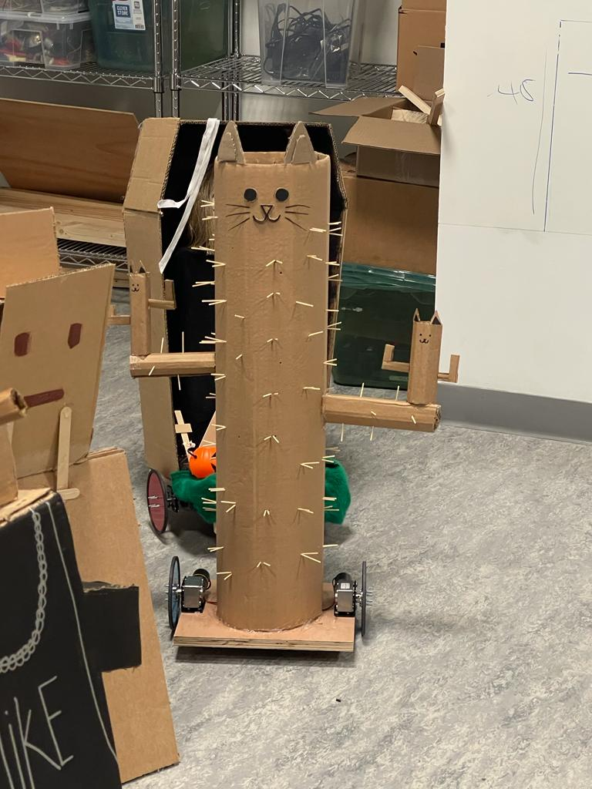

# Cat Cactus Robot

# Table of contents
1. [Images of the Final Product](#introduction)
2. [Videos](#imagesFinal)
3. [Pictures of Work in Progress + Plans](#imagesWIP)

## About the Cactus 

For this assignment, we had to create a body for the platform robots. Our concept revolved around making a cactus cat. We wanted to make a sturdy robot that could bump into people and things without breaking, and cacti are sturdy in their natural habitat. Another part of our plan was to add sliding hatch in the back, which would help us access the arduino and the electrical parts comfortably. The final product ended up looking as planned, but one thing that could be worked on is the opening at the top. Closing it would help protect the electronics just a bit better.

## Images of The Final Product 

## Videos

[Here is a video of the cat cactus in action!](https://youtu.be/E3FCLbn6hOI)

## Pictures of Work in Progress + Plans 

