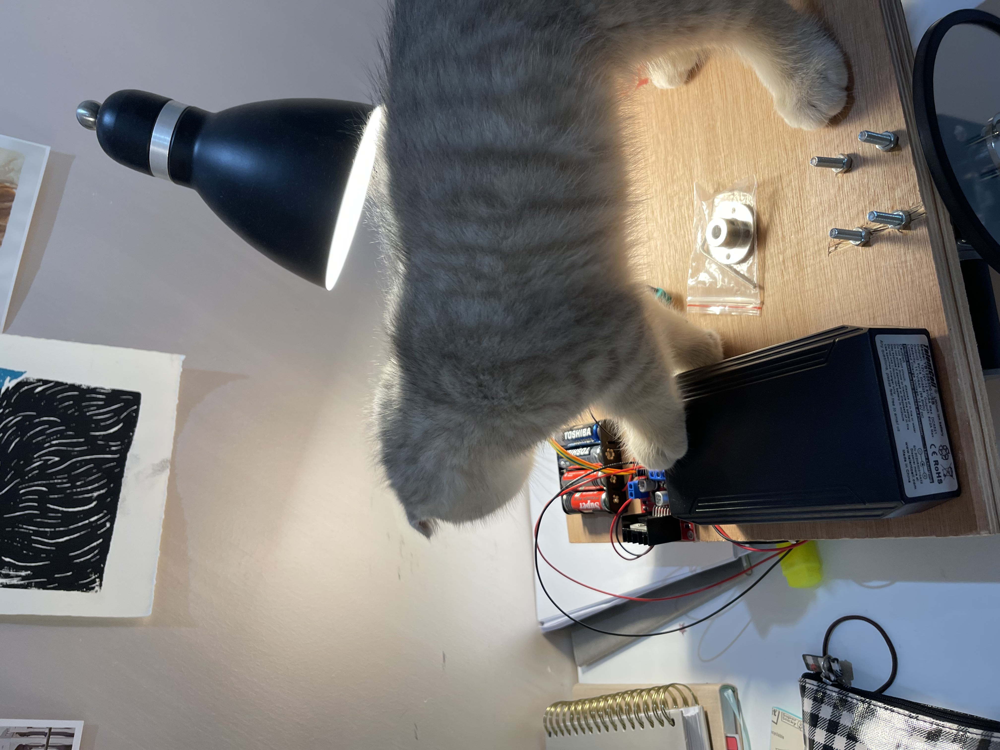

# Anxious Robot
For this production assignment, we have decided to program our robot to exhibit anxious behavior and go through a cyclic process. We started by brainstorming different ways to showcase that, and came up with two distinct motions, as well as a final motion to resolve the robot's inner turmoil and anxiety.

## Motion and Behaviors

The two main motions were:

- Jittering
- Spinning

The jittering motion represents indecisiveness and hesitancy. The robot seems scared of approaching something or is hesitant to do so.

The spinning motion could more or less represent a panic attack or an extremely anxious state, where the robot does not know what to do.

We did not want to leave our robot as an anxious mess. So, we decided to give it a chance to resolve his anxiety by letting him move forward very fast to showcase that he has overcome his fears and anxious state and will take on whatever life throws in his way. But then... the panic sets back in and the little robot has to go through everything again. 

## Code

In terms of our code, we implemented the noDelay method so that nothing gets interrupted. We also utilized if statements to carry out each motion. We had to troubleshoot a lot of things in the code, from figuring out how to use the noDelay method efficiently to trying to get the robot to do what we want it to do exactly.

One thing that really set things on the right path for us was incorporating boolean values for the three different states of motion. This allowed us to keep track of what motion is being implemented and what should happen when it isnt. Another thing that really helped us was using counters, this allowed us to keep track of how long each motion was taking to be implemented.

## Links to Videos

[Video of the robot running properly! :> ](https://www.youtube.com/watch?v=h3r3IlOu2kA)

[Pets + Robot ! :> ](https://www.youtube.com/watch?v=kqx_gVGP55E)

