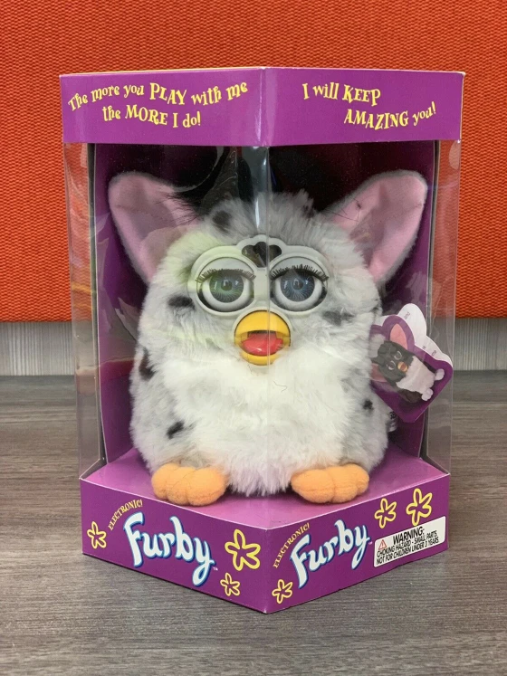

# Robots and Communication 

In the paper, the authors present a project of performing physical agents based on Woggles. Woggles are video agents, they are not physical agents. It was interesting to read about the developments that these authors were working to turn these virtual agents into physical ones and all the implimentations they went through to do so. 

I was very intrigued by their use of IR transmission instead of video cameras to tell the robots what to do and how to interact, while still maintaining an illusion of “vision”. The performers can control them that way and the audience would not know that the robots themselves are not the only ones performing.

In the paper, the authors also discussed the different types of interactions and communication that can happen between the agents (the robots), the performers and the audience. This made me wonder, have these authors considered what happens when the only method of communication that occurs is between the audience and the agent. This removal of the performer, which in this case is the agent itself, creates an interesting dilemma for the creator of such agents. What happens when the agent is left to interact with the audience. This is a very common occurance nowadays but I researched the first occurances of such performances and came across toys. Toys are perfect agents for experimenting with robots as performers. Their main purpose is to entertain and amuse. I have added pictures of a few performing toy robots. These toys have physical components and sensors which allow them to interact directly and autonomously with their audience, they don't need a performer to accompany them. 

