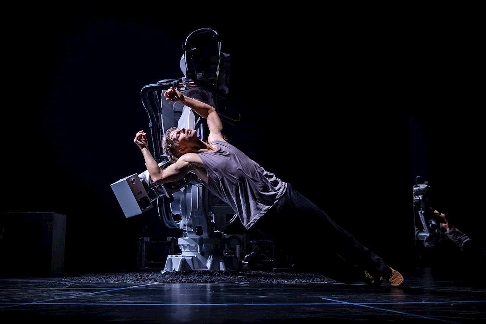

# On Stage: Robots as Performers 

This reading was an interesting introduction to a new topic, HRI. I've always read articles about HCI and how to develop better interfaces and programs for digital,virtual agents, but never considered the design and though that goes behind human robot intereactions. I also appreciated the authors' reliance on theatre philosophies and theories that once were exclusive to human agents only. 

The most interesting ideas discussed, some observations I have made and a few questions: 

<ol>
  <li>Performance as a space for experimentation of HRI.</li>
  <li>The controlled environment that the stage provides.</li>
  <li>Scenes as sequences of beats which manage to have enough flexiblity within them.</li>
  <li>The robots given some agency (are not fully controlled).</li>
  <li>Musical Robots:</li>
  <ol>
    <li>Robotic musical instruments.</li>
    <li>Anthromorphic musical robots that imitate human artists.</li>
  </ol> 
  <li>How likely is it that we reach a stage of utmost acceptance for robot performers? Will an audience be able to relate to them as much as they do a human agent?</li>
  <li>Continuity:  </li> 
  <ol> 
    <li>Inner Monologue, something within you that must always be there, regardless of whether you have lines or not.</li> 
    <li>For robots, this involves input, decision nodes, and "a multilayered stream of constantly changing internal parameters".</li>
  </ol> 
  <li>Responsiveness: </li> 
   <ol> 
     <li>Machines should be able to react, within good time, continuously, so must their human partners. This seems to be key to maintain the illusion of a performing robot.</li> 
     <li>Robots should also be able to self-correct should something go wrong in performances, this is what human actors do too. </li> 
     <li>Should performing robots always have a puppeteer on standby should things go wrong? Why or why not? </li>

  </ol> 

</ol>
